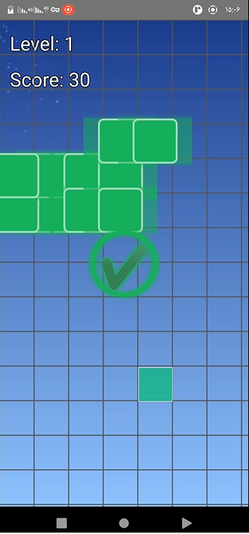
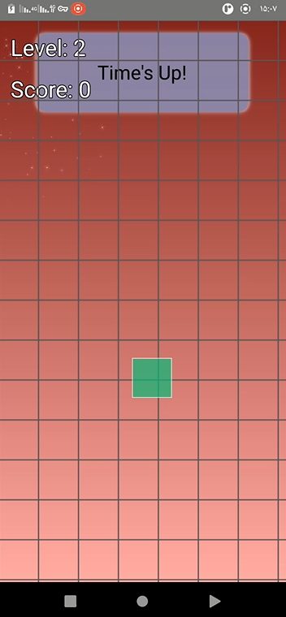

# Pattern-Game

A **Qt/C++ pattern-matching game** with interactive graphics, AI hints, and particle effects.  
Designed **only for Android** using **Clang**, this game challenges players to recognize and match patterns while enjoying smooth animations and responsive gameplay.

---

## Features

- Interactive pattern-matching gameplay  
- AI-based hints via `AIController.cpp/.h`  
- Smooth animations and graphics with particle effects  
- **Android-only** (built with Clang)  
- Responsive design with touch support  
- Screenshots and video demo included  

---

## Screenshots & Video

- Screenshots: `screenshots/`  
  - `screen1.png`  
  - `screen2.png`
  
  
- Demo video: `screen-video.mp4`  

---

## QML Files

Located in `qml/` folder:

- `Main.qml` – main UI entry point  
- `Game.qml` – game scene and logic  
- `Player.qml` – player representation  

---

## Particle Resources

Located in `particleresources/` folder:

- `glowdot.png` – particle effect image  
- `star.png` – particle effect image  

---

## Getting Started

### Prerequisites

- **Qt 6.x** with **Qt Quick + Qt Quick Controls 6**  
- **Clang** (for Android build)  
- Android SDK & NDK installed  
- Git (optional, for version control)  

### Running the project

1. Clone the repository:

```bash
git clone https://github.com/hasa1368/Pattern-Game.git
cd Pattern-Game
Open Pattern-Game.pro in Qt Creator.

Set Android kit with Clang as compiler.

Build and deploy to your Android device.

Enjoy the game and try to match all patterns!

Project Structure
bash
Copy code
Pattern-Game/
├── android/                  # Android deployment files
├── particleresources/        # Particle images for effects
│   ├── glowdot.png
│   └── star.png
├── qml/                      # QML files for game UI
│   ├── Main.qml
│   ├── Game.qml
│   └── Player.qml
├── screenshots/              # Screenshots of the game
│   ├── screen1.png
│   └── screen2.png
├── AIController.cpp/.h       # AI logic for pattern hints
├── main.cpp                  # Entry point of the application
├── Pattern-Game.pro          # Qt project file
├── qml.qrc                   # Qt resource file for QML/assets
├── README.md                 # This README
└── screen-video.mp4          # Demo video of gameplay
Notes
Patterns and levels are stored in qml/, particle assets in particleresources/.

AI hints provide guidance but do not automatically solve patterns.

Screenshots and demo video help visualize gameplay before running.

This project is for Android only, desktop is not supported.

Author
Hamed Sadeghi Firouzja
